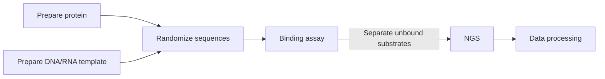
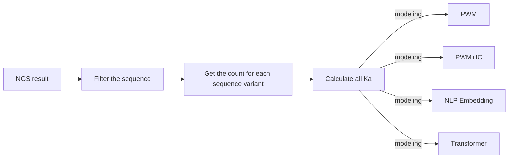
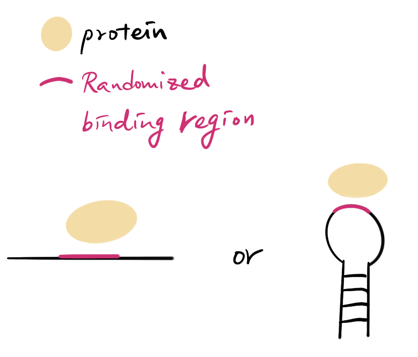

# Get the whole picture of your DNA/RNA binding protein/enzyme specificity in just one easy experiment - Experimental design and Data analysis (HiTS-EQ/HTS-EQ)

## Purpose
DNA/RNA binding protein/enzymes are critical in biological functions. Some can be engineered to enhance or decrease the specificity. There are also issues about off targeting when we do gene therapy. Here we provide a magical and easy way to understand your protein binding profile which is able to save your time and money. This tutorial provides detail about experimental design and source codes for next generation sequence data analysis. 

For Experiment:


For Data processing:



## Citation

If you think this tutorial is useful for you, you are welcome to cite the two following publications. I will be really appreciated.

1. [Lin HC, Zhao J, Niland CN, Tran B, Jankowsky E, Harris ME. Analysis of the RNA Binding Specificity Landscape of C5 Protein Reveals Structure and Sequence Preferences that Direct RNase P Specificity. Cell Chem Biol. 2016 Oct 20;23(10):1271-1281. doi: 10.1016/j.chembiol.2016.09.002. Epub 2016 Sep 29. PMID: 27693057; PMCID: PMC5088717.](https://pubmed.ncbi.nlm.nih.gov/27693057/)

1. [Jain N, Lin HC, Morgan CE, Harris ME, Tolbert BS. Rules of RNA specificity of hnRNP A1 revealed by global and quantitative analysis of its affinity distribution. Proc Natl Acad Sci U S A. 2017 Feb 28;114(9):2206-2211. doi: 10.1073/pnas.1616371114. Epub 2017 Feb 13. PMID: 28193894; PMCID: PMC5338530.](https://pubmed.ncbi.nlm.nih.gov/28193894/) 

## Things you will need:
- Your proteins - you need your protein or enzyme to finish the measurement however they are expressed or purified.

- Your default DNA/RNA sequences - This sequence is by default, the most studied or well known target of your protein. It will become the “standard” to normalize the measurement.

- DNA/RNA random library - The DNA/RNA sequence with random binding region and identical structure of your default sequence. You can order random PCR primers and the default sequence template to create your library.

They can be in several forms!



- Library preparation kit for next generation sequencing

- R and Rstudio installed in your computer.
- Python 3 with required packages - pandas, matplotlib, scikit-learn, numpy

- Finally your magical hands to make magic happen!

## Experimental design and procedure
Step 1. Get the binding constants of your default and random sequence library.
In this step, the dissociation constant ($K_d$) of both default and random sequence library should be measured by the way you used every day. It can be gel filtration, gel separation, HPLC, mass spectrometry, LC-MS, or anything.

Then the following plot can be provided:


     
Step 2. Now let use the s to calculate what is the required protein/enzyme concentration for 0%, 25%, 50%, 75% binding. Of course for 0%, you can just take your random library and following the same sample preparation procedure as random library. (It is kind of necessary because we will use it to normalize and let the internal error go away.)

Step 3. After mixing your random library with your protein or enzyme, separate the protein-sequence complex and take the “unbound one” for further NGS analysis.


     
Step 4 NGS sample preparation - Just follow the sample kit instruction to prepare your samples and send them to your NGS facility.

###There are some pixie dusts might be useful for you:

- When designing PCR primers for amplify your sample, make sure to use qPCR to check the amplification curve. Sometimes primers can be weird when your sample concentration is low or extremely low.
- Before sending to NGS, the samples can be normalized to similar concentration for sequencing purpose.
- When you design the randomize sequence, I would suggest for each sequence in the control group (no protein added), the final read should above 300~500 to make sure the quality of the result. You can calculate it roughly by (Total Reads) / (4^N).
Here N indicates the number of the randomized nucleotides in your binding region.

## Post NGS data processing
After getting your data in fastq or fq form after demultiplexing, it’s time to get your binding profile.

### Filter the sequence
When you get your sequence result, not all the sequences are what you want - we need to filter it by specific sequence. You can define your own pattern sequence and use [harris_filter-current.py](harris_filter-current.py) to filter it.

1. Change the hyparameter in [harris_filter-current.py](harris_filter-current.py) for your need. They are 
	- test_seq -> This is the sequence as your filter.
	- sequence_start -> Where the sequence start. For example, if your filter sequence start at 3, then the value is 2 because python starts at 0 not 1.
1. After setting up those parameters, put your fastq or fq files with the python code in the same folder.
1. In the terminal, enter the following command

```python
python harris_filter.py <fastq file> <modified fastq file>
``` 
### Get the count for each sequence variant
The next step is to get the count for each sequence varient from the exported file at last step. Here we need to use [harris_report_auto.py](harris_report_auto.py) to get the counts.

```python
python harris_report.py <your fastq file> <your export file in tab form> <the location of your first random nucleotide> <how many randomized nucleotides> <included two random sequence or not>
```

For example:

```
python harris_report.py EQB_ATC_1.fq_p.fastq EQB_2_1.tab 26 6 1
```

### Calculate all dissociation constants in just one step (HiTS-EQ)
**You can visit the repository [here](https://github.com/hsuanchunlin/HiTS-EQ)**

**[Derivivation of the equation](https://github.com/hsuanchunlin/HiTS-EQ/blob/master/Equation/EQ-directFit.pdf)**

After getting the counts for each sequence variant in each concentration, you need to make a .csv file in the following format and provide both binding fraction and protein concentration.

You are able to find the sample input file [here](https://github.com/hsuanchunlin/HiTS-EQ/blob/master/import_data.csv)

2. Put the .csv file and the R code provided in the same folder. You should modified some parameters properly to make sure the outcome is exported correctly. Currently our source code support 4 or 6 concentration points.
You can find the R code [here](https://github.com/hsuanchunlin/HiTS-EQ/blob/master/HiTS-EQ_v2.R).

1. Now you can get the list of Kds in the .csv file.

| sequence | K | KA | RKA |
|----|-----|-----|------|
|AAAAAA| 7.97 | 0.13 | 1.89 | 
|AAAAAC|8.60 | 0.12	| 1.75 |
|......|....|....|....|
1. Execute the R code and now you shall have all the Kd or Ka for all the sequence variants.

You can find more information in [my github repository](https://github.com/hsuanchunlin/HiTS-EQ). 

## Discover the dataset

1. You can use ViennaRNA to predict those secondary structures and might find something magical. [The ViennaRNA Package](https://www.tbi.univie.ac.at/RNA/)
2. We also created PWM, PWM+IC, and data visualization tools. You might think those R codes are useful for mining your data. [PWM/PWM+IC model](https://github.com/hsuanchunlin/PWM_IC_model) and [visualization of PWM/PWM+IC model](https://github.com/hsuanchunlin/Data-Visualization-PWM-PWMIC)
More complete tutorial of this visualization method is on the way!
3. You also can use Natural language processing (NLP) skills to discover the dataset. Here I used the Embedding and Bi-LSTM methods to group RNA sequences. [Here](https://github.com/hsuanchunlin/Embedding-RNA)
4. Self-Attention (Transformer) model provide a way to see each sequence variant individually. The repository is [here](https://github.com/hsuanchunlin/Transformer-RNA).
